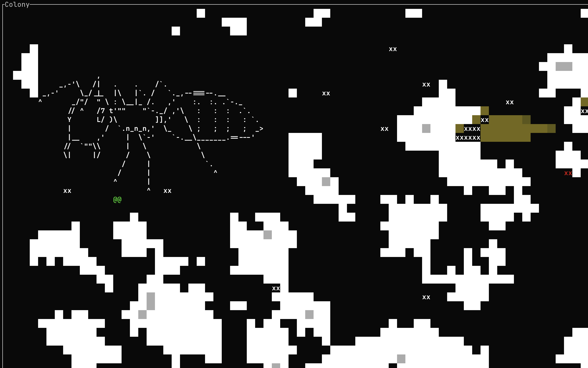

# Antfarm

Cross-platform terminal ant colony game prototype in Rust.

## Workspace

- `crates/antfarm-core`: shared world simulation, tile rules, protocol messages
- `crates/antfarm-server`: authoritative TCP server with a ticking world state
- `crates/antfarm-tui`: terminal client built with `ratatui` and `crossterm`

## Current vertical slice

- scrollable world larger than the viewport
- one authoritative shared world process
- up to five simultaneous players
- player movement above ground and underground
- digging dirt and resources
- placing dirt back into the world
- placing stone back into the world
- stone obstacles
- deterministic layered world generation with configurable seed and max depth
- bedrock at configured max depth
- shallow food veins and deeper ore veins
- config-driven soil settling
- SQLite snapshot persistence with startup restore
- NPC ants that tunnel toward players and disturb them
- modal help overlay

## Run

In one terminal:

```bash
./antfarm server
```

In one or more additional terminals:

```bash
./antfarm client scout
```

If you omit the name, the client defaults to `worker-ant`:

```bash
./antfarm client
```

To connect to a non-default localhost port:

```bash
./antfarm client --port 14461 scout
```

For multiplayer testing from the same folder without reusing the disk-backed token/history:

```bash
./antfarm client --dev scout-a
./antfarm client --dev scout-b
```

`--dev` uses a random in-memory client token, defaults to not showing help at startup, and does not read or write client config/history files.

On startup, the live client now shows a server-selection list. It always includes localhost on the configured port and also lists antfarm servers discovered on the LAN via mDNS. Use `j/k` or the arrow keys to choose a server and press `Enter` to connect.

To run the headless determinism test:

```bash
./antfarm test
```

That test now also writes a deterministic replay artifact to:

```text
.artifacts/tests/replays/headless-determinism/latest/replay.json
```

To replay and verify one deterministic replay artifact:

```bash
./antfarm replay ./.artifacts/tests/replays/headless-determinism/latest/replay.json
```

To open a replay in the terminal viewer:

```bash
./antfarm replay-tui ./.artifacts/tests/replays/headless-determinism/latest/replay.json
```

To run a single experiment-configured server:

```bash
cd ./experiments/experiment-1
../../antfarm server
```

This defaults to `./server.yaml` in your current directory. You can still point at a file or directory explicitly:

```bash
./antfarm server --server-config ./experiments/experiment-1/server.yaml
./antfarm server --server-config ./experiments/experiment-1
```

The server bind settings now come from `server.yaml`:

- `config.network.bind_host`
  defaults to `0.0.0.0` so the server is reachable from other machines on the LAN
- `config.network.port`
  defaults to `14461`

If you want localhost-only behavior again, set:

```yaml
config:
  network:
    bind_host: 127.0.0.1
    port: 14461
```

If that experiment config defines named conditions, select one explicitly:

```bash
./antfarm server --server-config ./experiments/experiment-1/server.yaml --condition baseline
```

To run the same experiment config multiple times:

```bash
./antfarm experiment --server-config ./experiments/experiment-1/server.yaml --num-runs 10
```

Use `h j k l` to move; filled tiles auto-dig. Use `Space d h/j/k/l` to place dirt and `Space s h/j/k/l` to place stone. Press `/` to enter a slash command like `/sc set soil.settle_frequency 0.01`, `/sc set world.max_depth -255`, `/sc show_params`, or `/sc world_reset`, `?` to toggle the help modal, and `q` to quit.

The server saves the latest world snapshots to `data/antfarm.sqlite3`, restores the newest one on startup, snapshots every `world.snapshot_interval` seconds by default, and prunes history down to the newest 10 snapshots after each save.

## Experiments

Experiment definitions live under `experiments/`. The `server.yaml` files stay in Git, while generated run artifacts are synced through S3 at `s3://antfarm/experiments/`.

To pull the current shared experiment state onto your machine:

```bash
scripts/sync-experiments-pull.sh
```

To run a single condition or a batch:

```bash
./antfarm server --server-config ./experiments/experiment-1 --condition baseline
./antfarm experiment --server-config ./experiments/experiment-1 --num-runs 10
```

Successful experiment runs and visualization generation mark the local `experiments/` tree as having unpushed data by creating `experiments/.unpushed_data`.

To push local experiment artifacts back to S3:

```bash
scripts/sync-experiments-push.sh
```

Recommended workflow:

1. `scripts/sync-experiments-pull.sh`
2. Commit the code changes that should be associated with the run artifacts.
3. Run the experiment or regenerate visualizations.
4. `scripts/sync-experiments-push.sh`

`sync-experiments-push.sh` writes `experiments/.sync_state.json` before upload. That file records the current Git branch, commit id, push time, and the latest discovered run metadata, including the run id and a SHA-256 hash of the run-local `server.yaml`.
